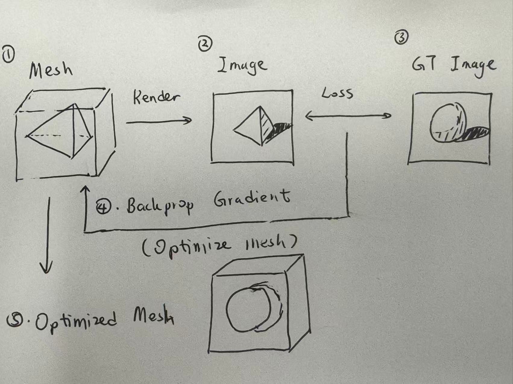
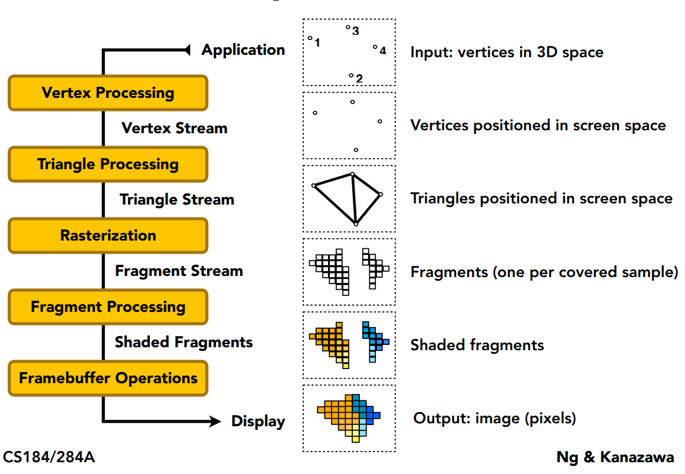
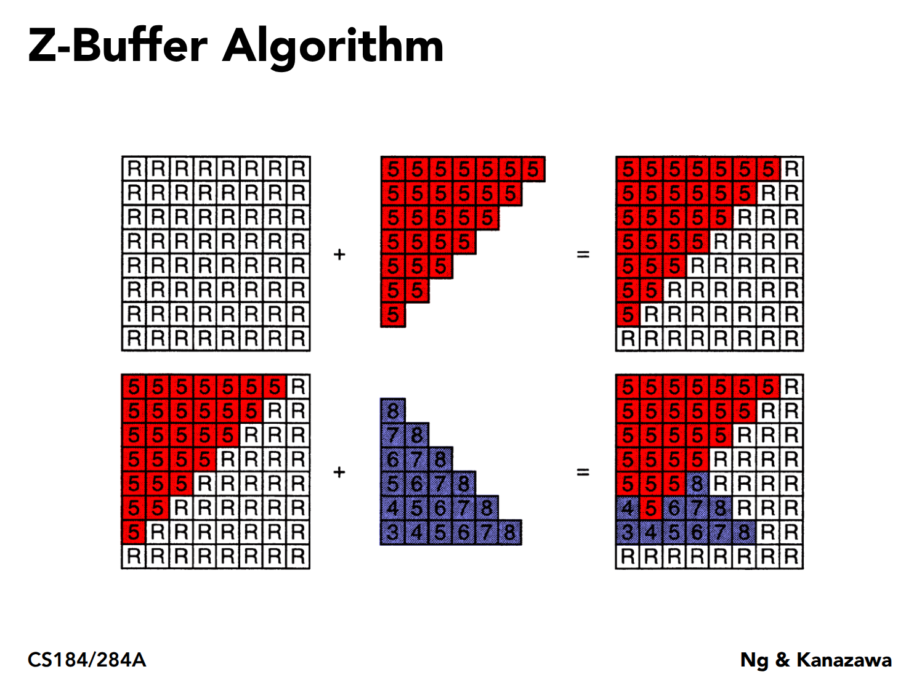
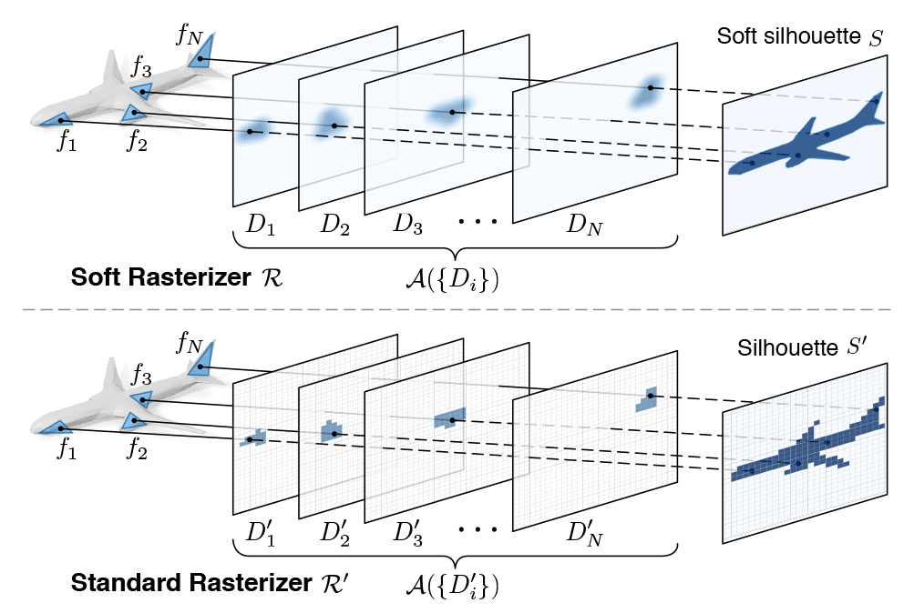
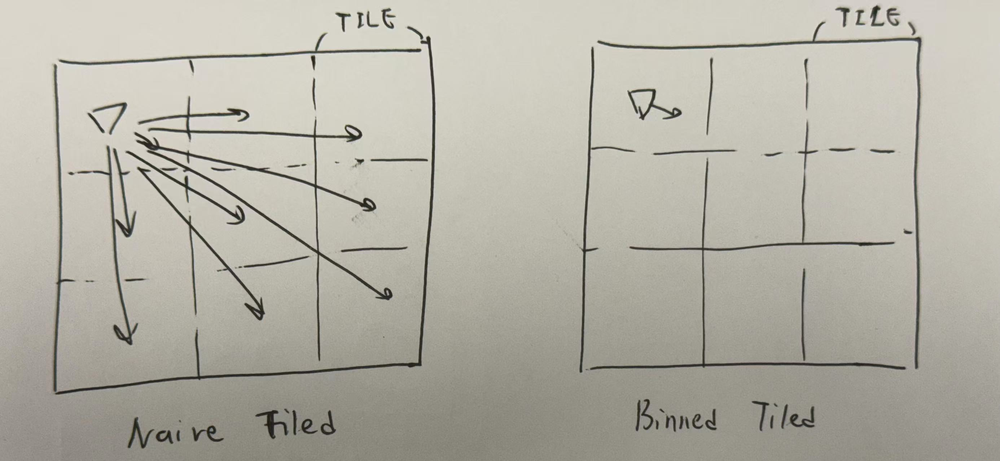
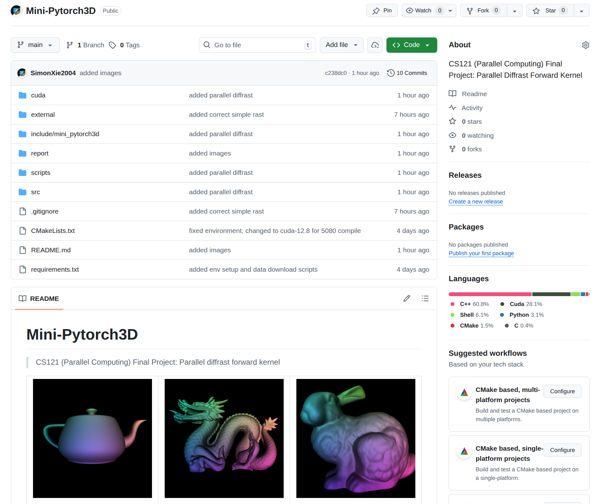

# Parallel Differentiable Rasterization Kernel

> CS121: Parallel Computing Final Project
> By Siyuan Xie, available at https://github.com/SimonXie2004/Mini-Pytorch3D

---

## Contents

1. Background
    1.1 What is rasterization
    1.2 Why **differentiable rasterization**
2. Efficient **differentiable rasterization** kernel implementation
    2.1 **Prerequisite**: Modern Rasterization Pipeline
    2.2 **Online** Pixel Blending (Online Softmax)
    2.3 **TILE** Based Rasterzation
    2.4 **Parallel** Triangle Bincount
3. Metrics
4. Summary

---

## 1. Background

### 1.1 What is Rasterization

Rasterization is the process of converting **geometric primitives**  
(triangles in clip / NDC space) into **discrete pixel values** on a 2D image grid.

---

### 1.2 Why Differentiable Rasterization

Today is the era of **Deep Learning**. Can we learn **3D structures from 2D images**?
***Ideally*** we have the following (actually, this don't work. why?):

---

### 1.2 Why Differentiable Rasterization

In the following case, red triangle contributes zero gradient. 
***Very brittle to optimize !!!!!*** This explains why pervious slide is not realistic.

---

## 2. Parallel Differentiable Rasterization Kernel

Challenges:
- **\[New Algorithm\]** Each pixel MUST receive contributions from **multiple triangles** to make it **differentiable**
- **\[Time Efficiency\]** Need for **Speed**!!!!! (faster inference, faster training)
- **\[Memory Efficiency\]** Multiple threads writing **same image buffer**

Goal:
> Design a **parallel/fast, work-efficient, differentiable** rasterization kernel.

---

### 2.1 Prerequisite: Modern Rasterization Pipeline

---

### 2.1 Prerequisite: Modern Rasterization Pipeline

In step.3 (rasterization), the **visibility test** makes everything not differentiable.

 

---

### 2.2 Online Pixel Blending (Online Softmax)

To make it differentiable, we adopt a **softmax-based blending formulation** instead of hard visibility test.

---

### 2.2 Pixel Blending (Softmax)

For pixel $p$, triangles $i \in \mathcal{T}_p$:

$$
w_i = \exp(\alpha \cdot (z_i - z_{max}))
$$

$$
C_p = \frac{\sum_i w_i \cdot c_i}{\sum_i w_i}
$$

where:
- $i$ denotes all triangles that contribute to this pixel
- $z_i$: pixel depth
- $c_i$: pixel color on the triangle
- $C_p$ finally blended color

Result: All triangle colors (i.e. $c_i$) now have contribution! Hence differentiable

---

### 2.2 Pixel Blending (Softmax)

For pixel $p$, triangles $i \in \mathcal{T}_p$:

$$
w_i = \exp(\alpha \cdot (z_i - z_{max}) )
$$

$$
C_p = \frac{\sum_i w_i \cdot c_i}{\sum_i w_i}
$$

**Problem 1**: This takes 3 passes. Rasterization loop is **Extremely Expensive**

1. calculate $z_{max}$
2. calculate $\sum w_i c_i$
3. normalize over $\sum w_i$

**Problem 2**: Must save all $c_i$ per pixel. Ill-formed memory access (Since #$c_i$ is not constant per pixel.)

---

### 2.2 Online Pixel Blending (Online Softmax)

Instead of storing all $w_i$, we compute blending **incrementally**:

Maintain per-pixel:
- Running max depth $m$
- Accumulated color sum $S_c$
- Accumulated weight sum $S_w$

For each new triangle contribution:
$$
m' = \max(m, z_i)
$$

$$
S_c' = S_c \cdot e^{\alpha (m - m')} + c_i \cdot e^{\alpha (z_i - m')}
$$

$$
S_w' = S_w \cdot e^{\alpha (m - m')} + e^{\alpha (z_i - m')}
$$

---

### 2.2 Online Pixel Blending (Online Softmax)

This avoids:
- Per-pixel triangle lists
- Global sorting
- Extra memory passes

Also, now only **two loops are enough!**
1. calculate running max $m'$ and online sum $S_c'$
2. normalize over $S'_w$

---

### 2.3 Tile-Based Parallel Rasterization

Non-parallel version:
- Suppose $N$ triangles, $K$ pixels per triangle
- Work is $O(NK)$

Naive parallelization over triangles:
- $P$ threads, each take some triangles to render and gather
- Gather needs atomic, redundant $O(NK\log P)$ work to gather

Naive tiled parallelization:
- Each thread test all triangles with his own tiled screen.
- Needs $O(NKP)$ work, extremely unplausible

---

### 2.3 Tile-Based Parallel Rasterization

> Left: $O(NKP)$ work; Right: $O(N + NK)$ work

Divide the image into fixed-size tiles (e.g. 8×8 or 16×16).
Distribute triangles to tiles ($O(N)$ work) and rasterize $(O(NK))$ work

---

### 2.4 Parallel Triangle Bincount

Key challenge:
> Efficiently assign triangles to tiles **in parallel**

Steps:
1. Compute tile bounding box for each triangle
2. Emit `(triangle_id, tile_id)` pairs
3. Perform **parallel bincount / prefix sum**
    (Now we have `int arr[tiles][max_triangles_per_tile]`)
    (Note that `max_triangles_per_tile` is not constant)
4. Flatten triangle lists per tile using **parallel exclusive sum**
    (Flatten to `int *arr` increase memory locality, avoid waste of memory)

---

### 2.4 Parallel Triangle Bincount

Time Comparison:

- Naive scan & distribute: $O(N)$
- Parallel bincount + prefix sum (to gather bins): $O(\log N + \log B)$
    suppose B is bin length; do prefix sum on bin length array

---

## 3. Metrics (Render Time)

- Sequential = sequential differentiable rasterization
- Parallel = parallel differentiable rasterization

| Mesh | Vertices | Faces | Sequential | Parallel | Rel. Speed |
| --- | --- | --- | --- | --- | --- |
| Stanford Dragon | 435545 | 871414 | 16192ms | 162ms | 99.95x | 
| Stanford Bunny | 34834 | 69451 | 6749ms | 98ms | 66.11x | 
| Utah Teapot | 3241 | 6320 | 2527ms | 89ms | 28.39x | 

Avg. Speedup = 64.81x

---

## 4. Summary

We implemented a differentiable rasterization kernel with:
- **Online softmax blending** ($3 \rightarrow 2$ rasterization loop optimize)
- **Tile-based parallelization** ($O(NKP) \rightarrow O(N+NK)$ work optimize)
- **Parallel triangle binning** ($O(N) \rightarrow O(\log N + \log B)$ time optimize)

Key contributions:
- Work/Time-efficient differentiable rendering
- GPU-friendly kernel structure
- ~64x Speedup

---

## Thank You

> By Siyuan Xie, available at https://github.com/SimonXie2004/Mini-Pytorch3D

